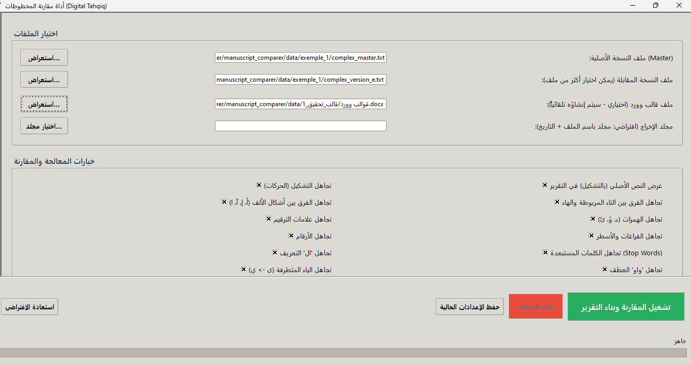
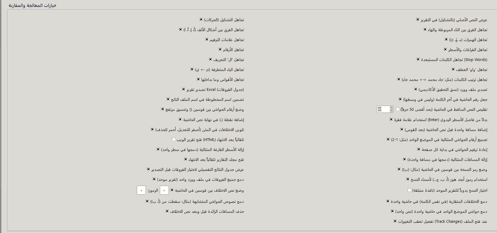
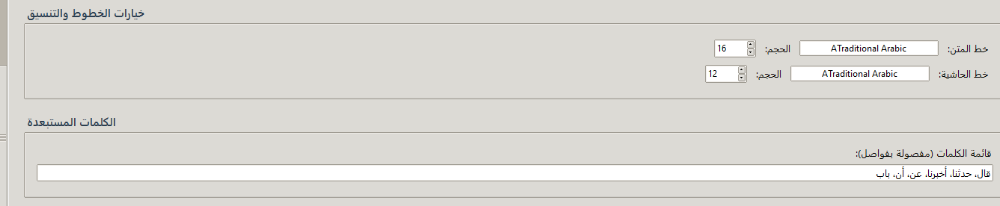
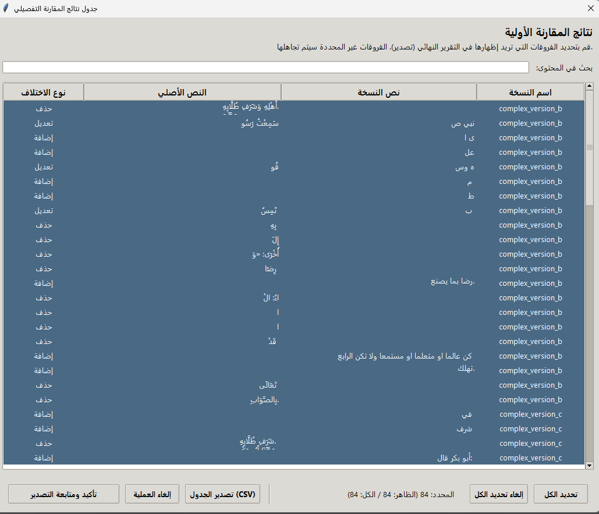
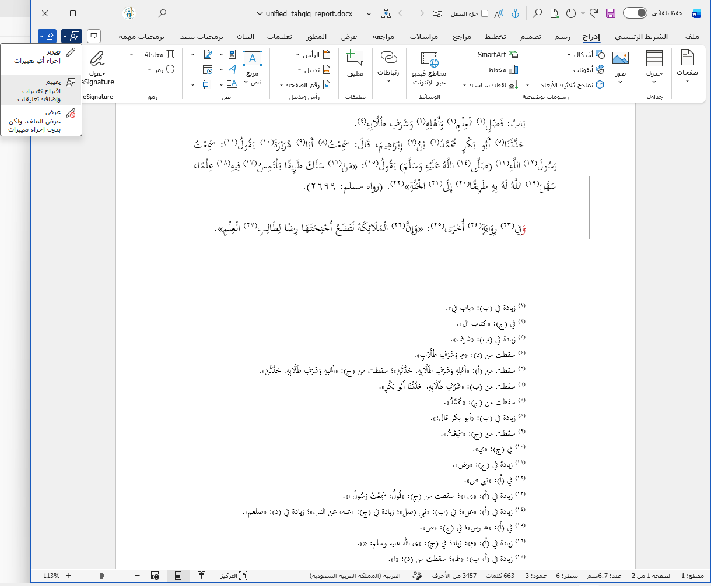

# 📜 مقارن المخطوطات (Manuscript Comparer)

أداة متقدمة مبنية بلغة بايثون (Python) لمقارنة النصوص والمخطوطات العربية، مع واجهة مستخدم رسومية (GUI) تفاعلية. تهدف الأداة إلى تسهيل عمل المحققين والباحثين في التراث الإسلامي والعربي من خلال استخراج الفروق بين النسخ المختلفة بدقة عالية مع إمكانية تجاهل الفروق الإملائية والنحوية حسب المراد.

## ✨ المميزات الرئيسة

* **واجهة رسومية تفاعلية**: واجهة سهلة الاستخدام تتيح رفع الملفات ومقارنتها بخطوات سريعة.
* **دعم السحب والإفلات**: إمكانية سحب وإفلات الملفات مباشرة إلى الواجهة.
* **دعم ملفات Word**: إمكانية قراءة النصوص مباشرة من ملفات الوورد (`.docx`).
* **خيارات تطبيع النص العربي (Text Normalization)**:
  * تجاهل التشكيل (الحركات) والتطويل (اقصد رمز ـ لتطويل الأحرف العربية).
  * تجاهل الفروق الشائعة مثل التاء المربوطة والهاء (مدرسة / مدرسه).
  * توحيد أشكال الألف (أ، إ، آ، ا).
  * تجاهل الهمزات المتطرفة أو الوسيطة.
* **خيارات مقارنة متقدمة مرنة**:
  * إمكانية تجاهل علامات الترقيم، والأرقام، والفراغات.
  * إمكانية تجاهل "ال" التعريف، و"واو" العطف، والكلمات المفتاحية المكررة (Stop words) مثل: "قال"، "حدثنا"، "أخبرنا".
  * تجاهل الأقواس وما بداخلها (مثل الجمل الاعتراضية: صلى الله عليه وسلم).
  * تجاهل الياء المقصورة والمنقوطة.
* **تقارير مفصلة**: تصدير نتائج المقارنة والفروق إلى ملفات Excel (`.xlsx`) وملفات نصية (`.txt`).
* **عرض ذكي للنتائج**: نافذة مخصصة لعرض الفروق بشكل منسق مع تحديد الإضافات والحذف ليختار المحقق ما يبقيه وما يتجاهله.

## 🖼️ جولة داخل التطبيق (لقطات الشاشة)

### الواجهة الرئيسية

### خيارات المقارنة

### جدول الفروقات

### مثال على النتائج

## 🛠️ التقنيات المستخدمة

* &rlm;**اللغة**: Python 3
* &rlm;**المكتبات الأساسية**: 
  * &rlm;`difflib`: لإجراء المقارنات واستخراج الفروق بدقة.
  * &rlm;`re`: للتعامل مع التعابير النمطية (Regex) لتنظيف وتطبيع النص العربي.
  * &rlm;`python-docx`: لقراءة ملفات الوورد واستخراج النصوص.
  * &rlm;`tkinter`: لبناء الواجهة الرسومية.

## 🚀 طريقة التثبيت والاستخدام

هذا المستودع يمثل واجهة استعراضية للمشروع قيد التطوير. للحصول على الكود المصدري أو تفاصيل إضافية حول التثبيت والاستخدام، يرجى التواصل معي.

## 🤝 المساهمة والتواصل

نرحب بجميع الاستفسارات والطلبات إذا كان لديك أي اقتراحات أو ملاحظات، يرجى التواصل معنا أو فتح **Issue** في هذا المستودع للاستفسار.

